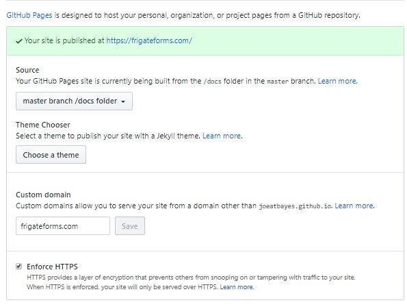

# Metadata Form GUI - Programmer Guide

## Basic Demo

### Page that was rendered:

* This page appears simple but it demonstrates a text box,  radio button select list, two way data binding,  Instant update of the underlying domain model.  [live version](https://frigateforms.com/)


### HTML Required to render page

The meta-forms.css,  browser_util.js, simple_ajaj.js, mforms.js and mforms_parse.js are the supporting libraries that drive the mforms  system.  They are required for every HTML page that want to render a form using the system.  In RIA applications one page may render hundreds of different forms   [source code](https://github.com/joeatbayes/metadata-forms-gui/blob/master/http-docs/demo/examples/simple-form.html)

```html
<html>
<head>
    <meta description="Simple Meta Data Forms Demo ">
    <link rel="stylesheet" type="text/css" href="css/meta-forms.css" />
    <script async src="js/browser_util.js" type="text/javascript"></script>
    <script async src="js/simple_ajax.js" type="text/javascript"></script>
    <script async src="js/mforms.js" type="text/javascript"></script>
    <script async src="js/mforms_parse.js" type="text/javascript"></script>
</head>
<body onLoad="display_form('form_div', 'data/forms/examples/simple-form',  null, GTX)">
    <h1>MForms - Meta Data Forms Demonstration</h1>
    <div id="form_div"></div>
    <div id="rnav"></div>
</body>
</html>
```

The main work in this HTML is performed by the display_form function which is called in the body onLoad event.

```html
<body onLoad="display_form('form_div', 'forms/simple-form',  null, GTX)">
```

* The first parameter "form_div" tells the system what <div> on the page to render the form into.  This allows the system to only deliver a portion of the functionality of the page.  Notice that an empty <div> with an id that matches "form_div" was created on the page prior to calling display_form().
* The second parameter "data/forms/examples/simple-form" tells the system to use an AJAX call and fetch that form specification from the server.    
* The third parameter "null" in this instance is an object id or other structure passed in to give the form the context needed to fetch data to render into the form from the server.     When it is set to null we start with an empty object that is filled in as the user fills in data on the form(s)
* The fourth parameter GTX represents data object where metaforms will look for contextual information.  Any data objects retrieved are stored here.  Any widgets and forms defined are also stored here.   A default version stored in the global variable GTX is defined in mforms.js we simply pass that various through so the forms system knows where to look for data.

### Form Specification to render sample

The form specification metadata is saved in a text file on the server and retrieved based on the name given when the display_form() method is called.   [sourcecode](https://github.com/joeatbayes/metadata-forms-gui/blob/master/http-docs/demo/examples/forms/simple-form.txt)

```yaml
-widget:
    id: pName
    label: Name
    title: Persons full name (Last, First, Middle Init, Suffix)
    size: 40
    data_context: person.name

-widget:
    id: pState
    label :State
    size: 2
    data_context: person.state

- widget:
    id: pFavCar
    type: dropdown
    label : Favorite Car
    data_context: person.fav.car
    option:
       - {"label" : "Ford", "value" : "F"}
       - {"label" : "Chevy", "value": "C"}
       - {"label" : "Tesla", "value" : "T"}
       - {"label" : "Nissan", "value" : "N"}

- widget:
    id: pOwnsCar
    data_type: text
    type: radio
    label : Owns Car
    data_context: person.owns.car
    class: vert_radio
    option:
       - {"label" : "Ford", "value" : "F"}
       - {"label" : "Chevy", "value": "C"}
       - {"label" : "Tesla", "value" : "T"}
     
- widget: 
   id: saveButton
   type : button
   label: Save
   size : 8
   class : submit_button
  
- form:
   id : simpleForm
   class: inputFrm
   label: Simple Form
   fetch:
      uri: data/sample/{dataObjId}.JSON
      method: GET
      parse: JSON
   save:
      uri: data/sample/{dataObjId}.JSON
      verb: PUT
      where: body
   show_data_obj_div: dataObjDiv
   widgets:   
     - pName
     - pState
     - pOwnsCar
     - pFavCar
     - saveButton

```

* #### Widgets are defined as an array using the "-" prefix

  The required values can be supplied using almost standard YAML syntax which is easy to read and edit but consumes more lines.   Alternatively they can be defined using JSON syntax as shown for the "SaveButton" which saves space but harder to read.id - a unique string used for mapping throughout the system.  When HTML is rendered 

  * **id** - a unique string used for mapping throughout the system.  When HTML is rendered 

  * **type** - The type of widget to render.  Defaults to a "text" to render a  text box if not specified.   Other types are date, dropdown, select, table, submit_button, etc.   Other types will be added over time and programmers can easily add custom rendering agents to support their own widget types.

  * **class** - The class used to style the widget.  Defaults to "input_field" if not specified.

  * **label** - The label to render for the field.  Defaults to same as ID if not specified

  * **data_type** - specifies parser and serialize when saving field value in JSON.  Defaults to text if not specified.   Also supports  numeric, int, date.

  * **data_context** - tells the system where to render .  For example a value of "person.owns.car" will cause the system to look for and update data inside a  {"person" : {"owns" : "car" : MyDataValue}}}

  * **size** - used to control basic rendering size of widgets.  For text boxes style fields it controls width.

  * **label_class** - optional field that allows additional control of label positioning, width and wrap behavior. 

* #### Forms are defined as an array using the "-" prefix

  * **id** - a unique string used to retrieve the form during various processing events.
  * **class** - main class used to style the form and it's contents.
  * **label** - A label to render for the form. 
  * **show_data_obj_div** - optional but when set it will cause JSON representing the current domain object as formatted JSON
  * **widgets** - A list of widget ID to render.  Each widget must be previously defined and must have an id that matches these id's
  * **fetch:** - Specification of where to go get data to render into the form.   This is normally a web service but may be a static file on the server.
    * **fetch.uri** - Which URI on the server to call when fetching data.   This supports variable interpolation which is what we use to specify which data object to retrieve when there may be many on the server.
    * **fetch.verb** - Which HTTP verb to send to the server when retrieving a data object
    * **fetch.parse** -Which kind of parser to use when parsing the return content.   Currently supports tab delimited,  CSV and JSON.
  * **save:** - Specification of where to send the updated data when editing has been completed.
    * save.uri - 
    * save.verb -
    * save.where -
    * save.send_incremental - Streams updates to object back to server as they are made during editing.  Can be useful to allow people to switch between devices when they have not finished editing.

* #### Some items not Shown for brevity but are supported:

  * Tables and data arrays with sort
  * field sets for grouping widgets
  * grouping divs to control layout
  * Multiple forms from Menu operation
  * Validation functions
  * validation patterns
  * Chaining Forms
  * Auto collapsing forms
  * Controlling form styling
  * Customizing styling for different brands
  * Localizing labels

* 

# Basic Form Usage

* ## Define a Widget

  * ### Hooking widgets to the Data Model

* 

* ## Define a form using the Widget

* Define Groups of Widget

* D

* ## Display the form

* ## How Metadata relates to Generated HTML

  * No matter how it is done we ultimately require markup to control how things are rendered in the web browser.    The Metadata forms system reads the metadata generates markup and injects it into a DIV in the browser to render the form.   The ultimate look and feel of the form is controlled by CSS.    We include some default CSS that can easily be customized or overridden to produce nearly any look and feel.    We generate a pretty standard containment div structure with heavy use of ID, class and custom HTML attributes to make it easy to render. 

  * Example of a Widget Metadata: 

    ```yaml
    - widget:
        id: preauthNumber
        data_type: text
        type: text
        label : Preauthorization number
        label_class: noWrap noWidth
        data_context: claim.insurance.preAuthRef
        class: input_field
        ignore-case-match: true
    ```

    Causes the generation of the following Markup.  The actual shape of the generated markup is controlled by the library but a number of  options exist to influence how things get rendered.  Some widgets like drop downs,  select boxes, etc generate larger amounts of markup.  

    Most of this developers guide involves showing you how to control the specifics ways system renders content and how you can control it to meet your specific needs.

    ```html
    <div id="preauthNumberCont" class="input_fieldCont">
       <label class="nowrap input_fieldLabel" for="preauthNumber" 
           id="preauthNumberLabel">Preauthorization number
        </label>
       <input id="preauthNumber" type="text" 
          onchange="mformFieldChanged(this)" 
          oninput="mformFieldInput(this)" 
          dataobjid="AUTO-1580573118535-518"
          form_id="dentalClaim" 
          data_context="claim.insurance.preAuthRef"
          class="input_field">
       <div class="fieldStatusMsg" id="preauthNumberStatus"></div>
    </div>
    ```

    

* 

* ## Modifying CSS to control form look & Feel

  * ##### Customizing Label Presentation

    * Widget Labels are by default rendered with a CSS class the same as the class: attributed with "label" appended.  For example if the  "class: input_field" is specified for the widget then the label will be rendered with "<label for="someid" class="input_fieldLabel>.  

      The default rendering for most instances but there are times when the behavior of the label must be modified for example the label "preauthorization number" is too long and will force wrapping if the label width is set to 8em.    

      When we want to override that behavior to prevent the wraping.  You can do this with direct css selectors by ID but we provide an attribute "label_class".    When label_class is specified,  it's class is added to the label class specifier before the default specifier.  

      Example: If you specify "class: input_field" and label_class "NoWrap AutoWidth" then the HTML rendering becomes "<label for "someid" class NoWrap AutoWidth input_fieldLabel"  

      ```
      - widget:
          id: preauthNumber
          data_type: text
          type: text
          label : Preauthorization number
          label_class: noWrap;
          data_context: claim.insurance.preAuthRef
          class: input_field
      ```

      Causes Generation of 

      ```
      <label class="noWrap input_fieldLabel" for="preauthNumber" id="preauthNumberLabel">Preauthorization number</label>
      ```

      

    * Use cases where label_class is useful:

      * Override default behavior of label width
      * Override wrapping behavior of label
      * Force wrapping so label appears above the field
      * Prevent Wrapping so label appears to left of field
      * Change color, text-size, background of the label so it behaves different than other labels.
      * 

* ## Example JSON Sample Data

* 

* ## Specifying Data Path in the Sample Data

* ## Suppressing the field group with Legend.

* #### Using Containers only for layout rather field grouping.

* Fetching contents of a select list from a Service

  * .
  * .
  * .

* Changing Contents of a select list based on contents of another field

  * .
  * .
  * .
  * .
  * 

  

* ## Alternate JSON representation of Widget

* 

* ## Specifying  URI to Fetch Data for the form

  * ### Interpolating Data into URI

* ## Redisplaying data from domain objects that have been modified but not saved.

  * By default the system keeps each object in the system with a unique identifier.   If the same object is requested for rendering again then it is rendered from the locally cached object.   This means that it is possible to modify an object switch to editing another and when you switch back the locally modified object will be re-displayed including any edits.  The cached object will remain available in this fashion until the page is refreshed or the browser is restarted.   You can clear an object from cache and force a reload.   
  * One option in the form specification is to clear domain objects after saving to force reload just in case it has changed on the server.   To clear on save  set   clearAfterSave=true in the form level attributes.
  * 

* ## Modifying Content of Dropdown based on prior form selections  

  * Example:  When user selects state then change the set of available zipcodes based on the state selected.  This can be done from sub setting data supplied at the time the form was loaded or by calling a  web service and modifying the affected fields widgets.   Introduces the notion of dependent fields or fields that are affected by actions of other fields.   As a general concept we prefer including the field ID for fields that could affect the operating of the current field. 

  

### Controlling / Disable Autocomplete

Autocomplete is a great feature but every so often such as advanced search forms we do not want fields filled in based on the selection of other fields.  In other instances the browser can choose to fill in incorrect values.    Mforms provides the ability to disable autocomplete with the autocomplete:  flag set at the form level.     When it is set, it sets the HTML attribute for the form to false and also generates a unique string for each field's auto complete.  This can help the browser avoid filling incorrect data into the fields. 

```yaml
- form:
   id : ProvSearchForm
   .... OTHER ATTRIBUTES 
```


## Using Custom CSS 

### Changing label wrapping behavior

.

.

.

### Forcing some fields to render on same line without wrapping

.

.

.

.

### Hide right nav when displayed on portrait mode on a phone.

.

.

.

. Adding Branded CSS 

..

.

.

. Using interpolation to allow brand specific styling

.

.

.

.Overriding default CSS styling with local stylesheets

.

.

.


## Injecting forms into Existing Pages


## Parsing Delimited Data


## Rendering Tables 


```

- widget:
  id: procedures
  type: table
  total_col:
    - arrProcFee
   max_visible_rows: 10
   min_rows: 8;
  columns: 
    - arrProcDate
    #- arrProcArea
    #- arrProcToothSystem
    #- arrProcToothNumber
    #- arrProcToothSurface
    #- arrProcCode
    #- arrProcDesc
    - arrProcFee


```


## Define Master Detail Forms


## Using YML Anchors to reduce repetitive Definition


## Changing Label Size for a subset of fields

Useful for example when State follows city on the same line.


### Validating using A RE pattern

The system has the ability to automatically apply regular expressions to validate the contents of a field.   An error message will be displayed as soon the system detects data that violates the required pattern and is removed as soon as the value becomes valid.     This was an explicit design decision because it allows users to fix data early before they are frustrated latter when they try to save.

The valid_pat: tag is used to specify the pattern to match and what message is displayed when the pattern based validation fails. 

Here is a example of the example form when the pattern validation failed.

 

Here is an example of when the same form field has a valid value 

[RE Pattern example src](data/forms/examples/field-validator-regex.txt)

```
-widget:
    id: basic_zip
    data_type: text
    type: text
    label :Zip
    size: 11
    data_context: person.zip
    class: input_field
    valid_pat:
       pattern: ^[0-9]{5}(?:-[0-9]{4})?$
       message : Invalid zipcode try 5 digits or zip plus 4. eg: 84401 or 84401-8178

- form:
   id : sample_field_validator
   class: inputFrm
   label: Regular Expression based Field Validator
   show_data_obj_div: dataObjDiv
   widgets:   
      - basic_zip
      
```

#### Validating with more than one RE pattern

In some instances it is necessary to perform more than one validation.  for example you may want to accept either the USA or French zipcode format.     The system supports this by allowing you to specify more than one pattern as an array.    The system will attempt to match any of he patterns and will consider a match against any single pattern as enough to consider the field value as valid.

[RE  Pattern Example with multiple patterns source](field-validator-regex-multiple.txt)

```
  valid_pat:
       pattern: 
         -^[0-9]{5}(?:-[0-9]{4})?$
         -^(([\d]{2} )|(2[abAB] ))*(([\d]{2})|(2[abAB]))$
       message : Invalid zipcode try 5 digits or zip plus 4. eg: 84401 or 84401-8178
```

​	Any of the patterns being satisfied will allow us to consider the  data in the field as valid.


### Validating using a built-in validation function

.

### Validating using a custom function

### Validating using a Web Service


## Filling in Option list or drop down with Web service Results


# Advanced Formatting


# Rendering Tables as Arrays

In some instances it can be desirable to render tables 

## Supporting Columns

#### Adjust formatting of table cell

In most instances table cells are rendered without a class specifier.  This is an explicit decision because tables cells can be selected in css using the class of the table.       For example for a table rendered with the class "mtable"  the <td> can be styled  using the selector "table.mtable td" this would affect all cells in the table.

```
table.mtable th,
table.mtable td {
  padding: 2px;
  text-align: left;
  border-left: 1px solid #000;
  xborder-right: 1px solid #000;
}
```

In some instances it is necessary to add styling explicitly to a cell.   For example if you want one column to be right justified when the default for the table is left justified.   This can be specified in the metadata using the cell_class as shown below

```yaml
- widget:
  id: arrProcFee
  # ... More Attributes
  cell_class: tdleft
  
```

When the cell_class is specified it will be added to the rendered HTML for the Table Cell.  You can include multiple class specifiers separated by space.

#### Modify Formatting for an entire Row

.

.

#### Adding a Total Row Tables

.

.

.


#### Determining which Table columns should have Totals

.

.

Choosing Table Sort Sequence

.

.

.

Allowing Client Side Sorting of Table

.

.

.

Adding Rows to a Table 


.

## Supporting groups of sections that must reflow together

.

## Designing to support mobile devices

.

## Forcing entire blocks to Reflow

.

## Designing to reflow individual forms


## Support for Subforms using TABS

## Adding Left Nav display of sub forms

## Expanding form sections that contain functions.

## Localizing forms

## Custom Labeling & Branding defined at runtime.

# Diagnostic Tools

## Display the JSON representation of object as it changes

The form attribute  **show_data_obj_div**:  is used to specify that you would like the system to render the JSON representation of the object in a Div that is refreshed every time a field is edited.   Display also occurs when the data if any is loaded from the server.    

This can be useful to ensure the right data elements are hooked to right underlying data models.   The value  specified is used as a DivId to display the JSON into. 

If the attribute is not specified then no rendering occurs.   **show_data_obj_div: dataObjDiv**  in the snippet below will try to render the JSON of the active data object to a HTML Div with the ID of "dataObjDiv" every time the field changes.   [See it in operation](https://joeatbayes.github.io/metadata-forms-gui/) 

```yaml

- form:
   id : basicForm
   label: A Basic Form   
   .... OTHER ATTRIBUTES
   show_data_obj_div: dataObjDiv 
   .... OTHER ATTRIBUTES

```


## Testing the YML Parser

.

## Creating a New repository

It can be useful to create a repository that contains only the code necessary to use mforms  and have an easy way to accept enhancements to mforms without risking overwritting your data.  The script [update-other-repo.sh](../../update-other-repo.sh) will copy the mforms directory and the sample page over to a new directory of your naming.  

The sequence of use is:

1. Create a Repository for the new project (I use github or bitbucket)
2. Clone that repository to a local directory
3. Run update-other-repo.sh naming that directory.
4. Create your own forms and HTML pages to render them.

```
#update-other-repo.sh targetDirectory
bash update-other-repo.sh ../demo-dir-2
```

* Note:  If you are publishing with gitpages auto publishing from the docs directory the HTML samples and forms must be present in the repo directory /docs directory.    You must enable this in the github settings page. Here is what ours looks like:  
  We used a custom domain but it works pretty much the same if you use their default pages.    Notice the master branch /docs  this is what tells gitpages to publish from the docs directory.  You can also publish from a branch.  Since our demo's use gitpages we copy everything you will need in the docs directory.
* It must be ran with the current directory set to the same directory where update-other-repo.sh is located on the local computer.   
* It will create the target directory if it does not exist.